# Requêtes

## - liste des matériels possédés par un client\*

```SQL
DELIMITER $$

CREATE PROCEDURE select_materiel_by_id_client(id_cli INT)
BEGIN
SELECT * FROM materiel WHERE id_client=id_cli;
END$$

DELIMITER ;
```

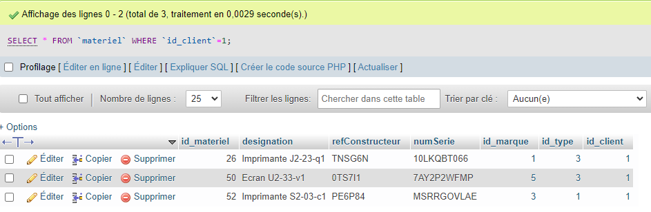
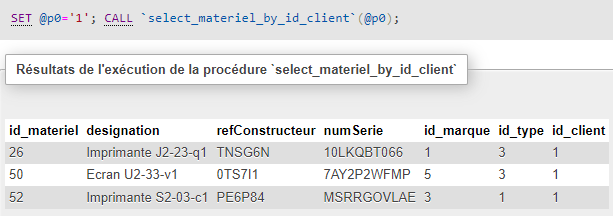

---

## - liste des tickets d'un client\*

---

## - liste des interventions liées à un client\*

```SQL
SELECT * FROM intervention
JOIN ticket on intervention.id_ticket=ticket.id_ticket
WHERE ticket.id_client=id_cli;
```


---

## - liste des interventions liées à un matériel\*

```sql
SELECT * FROM `intervention`
JOIN ticket on intervention.id_ticket=ticket.id_ticket
JOIN materiel on ticket.id_materiel=materiel.id_materiel
WHERE ticket.id_materiel=6;
```

---

## - liste des interventions liées à un type de matériel\*

```sql
SELECT
	type.id_type,
    type.libelle,
    intervention.id_intervention,
    intervention.dateIntervention,
    intervention.tempsPasse
FROM `intervention`
JOIN ticket on intervention.id_ticket=ticket.id_ticket
JOIN materiel on ticket.id_materiel=materiel.id_materiel
JOIN type on materiel.id_type=type.id_type
WHERE materiel.id_type=1;
```

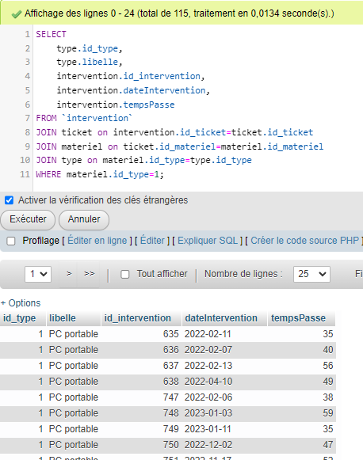

---

## - liste des interventions liées à une marque de matériel\*\*

```sql
SELECT
	marque.id_marque,
    marque.nom,
    intervention.id_intervention,
    intervention.dateIntervention,
    intervention.tempsPasse
FROM `intervention`
JOIN ticket on intervention.id_ticket=ticket.id_ticket
JOIN materiel on ticket.id_materiel=materiel.id_materiel
JOIN marque on materiel.id_marque=marque.id_marque
WHERE marque.nom="Dell";
```

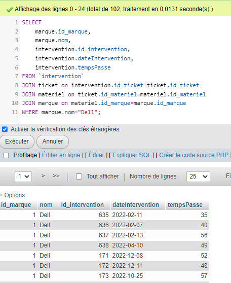

---

## - liste des interventions liées à un technicien\*\*

```sql
SELECT
	technicien.id_technicien,
    technicien.nom,
    technicien.prenom,
    intervention.id_intervention,
    intervention.dateIntervention,
    intervention.tempsPasse
FROM `intervention`
JOIN technicien ON intervention.id_technicien=technicien.id_technicien
WHERE technicien.id_technicien=1;
```
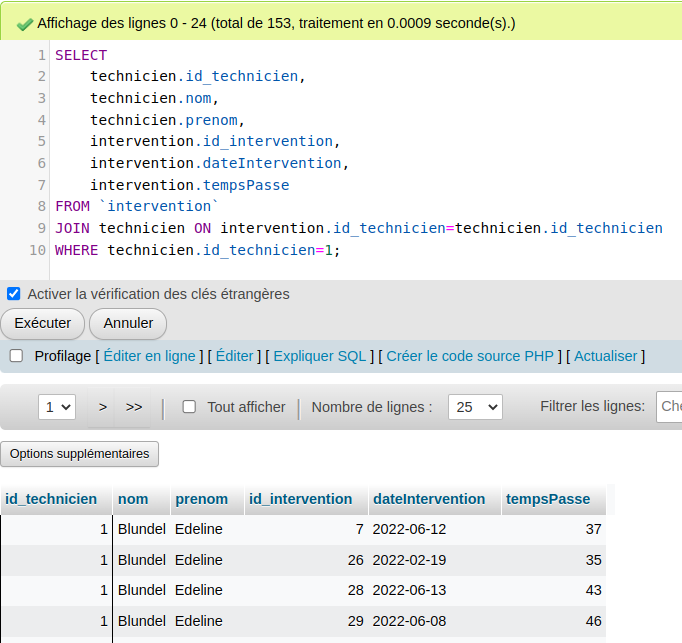

---

## - liste des interventions ayant duré plus que la moyenne des interventions\*\*

```sql
SELECT * FROM intervention WHERE tempsPasse >
(SELECT AVG(tempsPasse) FROM `intervention`)
ORDER BY `intervention`.`tempsPasse` ASC
```

## - total des durées des interventions d'un ticket / par ticket\*\*

```sql
SELECT SUM(intervention.tempsPasse) FROM `ticket`
JOIN intervention ON ticket.id_ticket=intervention.id_ticket
WHERE ticket.id_ticket=id_tic;
```

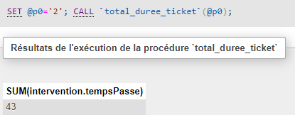

---

## - duree moyenne de résolution d'un ticket\*\*\*\*

```sql
SELECT AVG(intervention.tempsPasse) FROM ticket as tic
JOIN intervention ON tic.id_ticket=intervention.id_ticket
WHERE EXISTS
	(SELECT intervention.id_intervention FROM intervention
    WHERE intervention.id_ticket=tic.id_ticket
     AND intervention.id_statut=2
    )
```

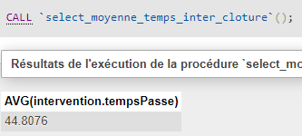

---

## - nombre moyen d'interventions nécessaires à la résolution d'un ticket\*\*\*\*

```sql
SELECT AVG(nbInter) FROM
(
    SELECT COUNT(intervention.id_intervention) as nbInter FROM `ticket` tic
	JOIN intervention on tic.id_ticket=intervention.id_ticket
     WHERE EXISTS (
        SELECT intervention.id_intervention FROM intervention
        JOIN ticket on intervention.id_ticket=tic.id_ticket
        WHERE intervention.id_statut=2
    )
	GROUP BY tic.id_ticket
) sub
```

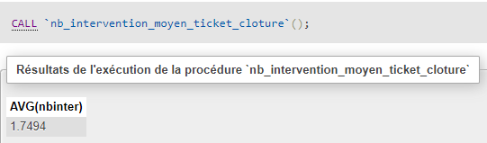

---

## - taux d'échec / par technicien / par client / par marque\*\*\*\*

-   Nombre de tickets non clôturés :

```sql
SELECT COUNT(*) FROM ticket
JOIN intervention ON ticket.id_ticket=intervention.id_ticket
JOIN statut ON intervention.id_statut=statut.id_statut
WHERE NOT EXISTS
	(SELECT intervention.id_intervention FROM intervention
    WHERE intervention.id_ticket=ticket.id_ticket
     AND intervention.id_statut=2
    );
```

-   Nombre de tickets non clôturés par technicien :

```sql
SELECT
	technicien.id_technicien,
    CONCAT(technicien.nom," ", technicien.prenom) as technicien,
    COUNT(*) as nbTickets,
    (SELECT COUNT(*) FROM ticket) as totalTickets,
    ROUND(COUNT(*)*100/(SELECT COUNT(*) FROM ticket), 2) as pourcTickets
FROM ticket
JOIN intervention ON ticket.id_ticket=intervention.id_ticket
JOIN statut ON intervention.id_statut=statut.id_statut
JOIN technicien ON intervention.id_technicien=technicien.id_technicien
WHERE NOT EXISTS
	(SELECT intervention.id_intervention FROM intervention
    WHERE intervention.id_ticket=ticket.id_ticket
     AND intervention.id_statut=2
    )
GROUP BY technicien.id_technicien;
```

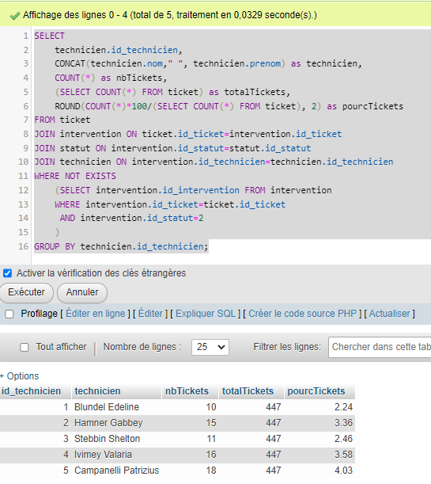

-   Nombre de tickets non clôturés par client :

```sql
SELECT
	client.id_client,
   	client.raisonSociale as client,
    COUNT(*) as nbTickets,
    (SELECT COUNT(*) FROM ticket) as totalTickets,
    ROUND(COUNT(*)*100/(SELECT COUNT(*) FROM ticket), 2) as pourcTickets
FROM ticket
JOIN intervention ON ticket.id_ticket=intervention.id_ticket
JOIN statut ON intervention.id_statut=statut.id_statut
JOIN client ON ticket.id_client=client.id_client
WHERE NOT EXISTS
	(SELECT intervention.id_intervention FROM intervention
    WHERE intervention.id_ticket=ticket.id_ticket
     AND intervention.id_statut=2
    )
GROUP BY client.id_client;
```

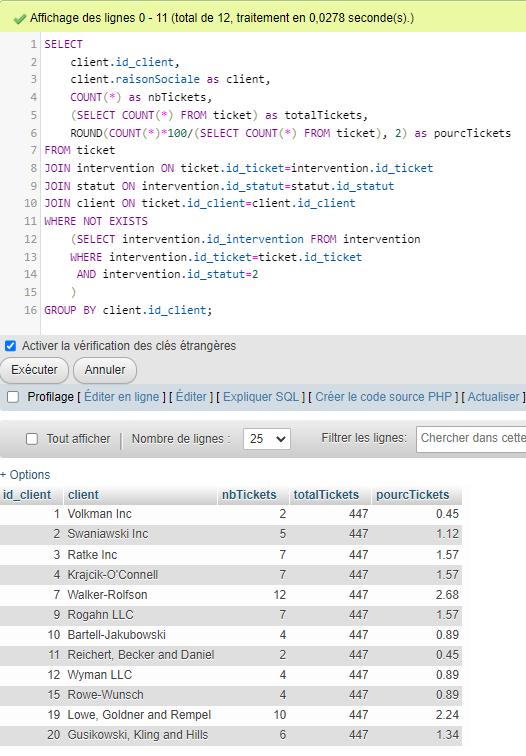

---

## - temps min, moyen et max d'intervention par technicien\*\*

```sql
SELECT
	technicien.id_technicien,
    CONCAT(technicien.nom,' ',technicien.prenom) as technicien,
	MIN(intervention.tempsPasse) as min,
    MAX(intervention.tempsPasse) as max,
    AVG(intervention.tempsPasse) as moy
FROM `technicien`
JOIN intervention ON technicien.id_technicien=intervention.id_technicien
GROUP BY technicien.id_technicien;
```

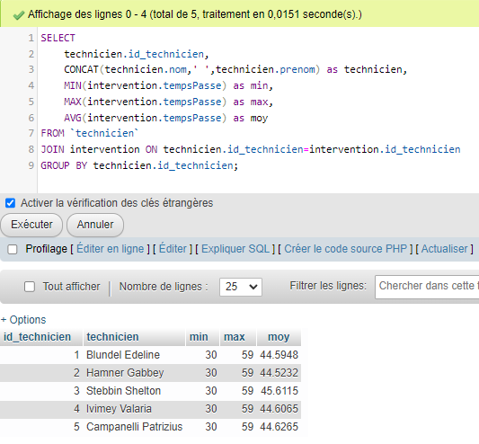

---

## - nombre d'interventions par semaine, par mois en 2022\*\*

-   Par semaine :

```sql
SELECT  DATE_FORMAT(dateIntervention,"%u") as semaine,COUNT(*) as nbInterventions FROM `intervention`
WHERE YEAR(dateIntervention) = '2022'
GROUP BY WEEK(dateIntervention)
ORDER BY semaine;
```

-   Par mois :

```sql
SELECT MONTH(dateIntervention) as mois,COUNT(*) as nbInterventions FROM `intervention`
WHERE YEAR(dateIntervention) = '2022'
GROUP BY MONTH(dateIntervention);
```

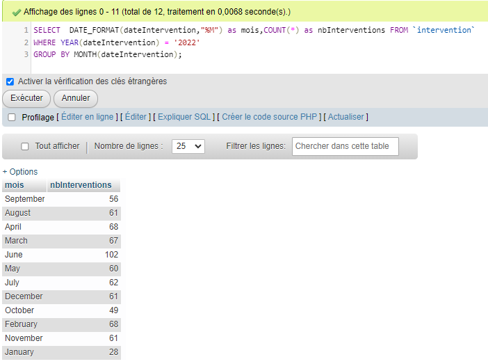

---

## - temps d'intervention par semaine, par mois\*\*

-   Par semaine :

```sql
SELECT
	WEEK(dateIntervention) as semaine,
    SUM(intervention.tempsPasse) as tempsPasse
FROM `intervention`
WHERE YEAR(dateIntervention) = '2022'
GROUP BY WEEK(dateIntervention)
ORDER BY semaine;
```

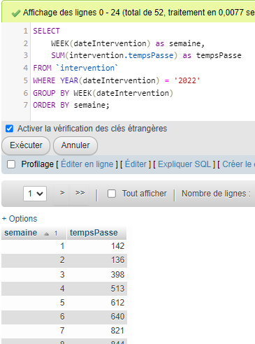

-   Par mois :

```sql
SELECT
	MONTH(dateIntervention) as mois,
    SUM(intervention.tempsPasse) as tempsPasse
FROM `intervention`
WHERE YEAR(dateIntervention) = '2022'
GROUP BY MONTH(dateIntervention)
ORDER BY mois;
```

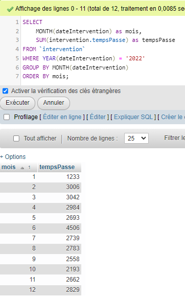

---

## - total des montants des pieces utilisées pour les interventions / par client\*\*

```sql
SELECT SUM(piece.puAchatHt) as total_pieces_HT FROM `intervention`
JOIN utiliser ON intervention.id_intervention=utiliser.id_intervention
JOIN piece ON utiliser.id_piece=piece.id_piece;
```

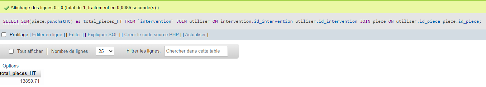

Par client :

```sql
SELECT client.id_client ,SUM(piece.puAchatHt) as total_pieces_HT FROM `intervention`
JOIN utiliser ON intervention.id_intervention=utiliser.id_intervention
JOIN piece ON utiliser.id_piece=piece.id_piece
JOIN ticket ON intervention.id_ticket=ticket.id_ticket
JOIN client ON ticket.id_client=client.id_client
GROUP BY client.id_client  
ORDER BY client.id_client  ASC;
```

---

## - taux de tickets par marque / par type / par client\*\*\*\*

-   Nombre de tickets par marque :

```sql
SELECT marque.id_marque,marque.nom, COUNT(*) as nbTickets FROM `ticket`
JOIN materiel ON ticket.id_materiel=materiel.id_materiel
JOIN marque ON materiel.id_marque=marque.id_marque
GROUP BY marque.id_marque;
```

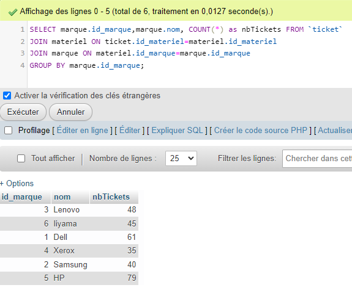

-   Taux de tickets par marque :

```sql
SELECT
	marque.id_marque,
    marque.nom,
    COUNT(*) as nbTicketsMarque,
    (SELECT COUNT(*) FROM ticket) as totalTickets,
    ROUND(COUNT(*)*100/(SELECT COUNT(*) FROM ticket),2) as pourcTicketsMarque
FROM `ticket`
JOIN materiel ON ticket.id_materiel=materiel.id_materiel
JOIN marque ON materiel.id_marque=marque.id_marque
GROUP BY marque.id_marque;
```

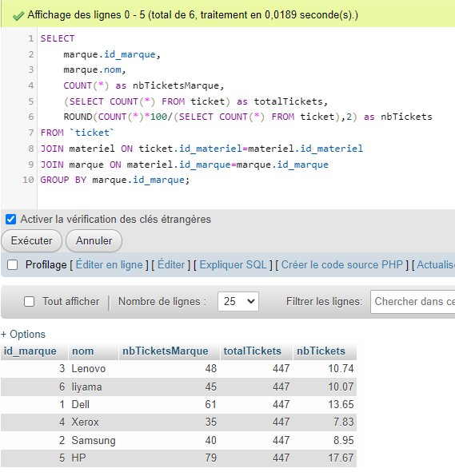

-   Taux de tickets par client :

```sql
SELECT
	client.id_client,
    client.raisonSociale,
    COUNT(*) as nbTickets,
    (SELECT COUNT(*) FROM ticket) as totalTickets,
    ROUND(COUNT(*)*100/(SELECT COUNT(*) FROM ticket),2) as pourcTicketsClients
FROM `ticket`
JOIN client ON ticket.id_client=client.id_client
GROUP BY client.id_client;
```

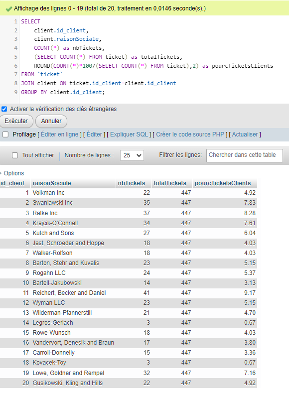

---

# Taux de tickets qui ne concernent pas un matériel

```sql
SELECT 
COUNT(*) / (SELECT COUNT(*) FROM ticket)
FROM `ticket`
WHERE ISNULL(ticket.id_materiel)
```

---

## - Quel est le technicien qui a le temps d'intervention moyen le plus faible\*\*\*

-   Tous les techniciens :

```sql
SELECT AVG(intervention.tempsPasse) as tempsMoyen, technicien.id_technicien, nom, prenom FROM `technicien`
JOIN intervention ON technicien.id_technicien=intervention.id_technicien
GROUP BY technicien.id_technicien
ORDER BY tempsMoyen ASC;
```

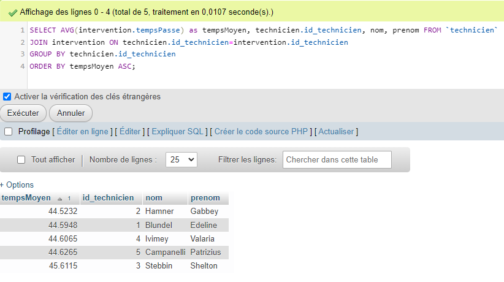

-   Le technicien qui a le temps d'intervention moyen le plus faible :

```sql
SELECT MIN(tempsMoyen) FROM
(SELECT AVG(intervention.tempsPasse) as tempsMoyen, technicien.id_technicien, nom, prenom
 FROM `technicien`
 JOIN intervention ON technicien.id_technicien=intervention.id_technicien
 GROUP BY technicien.id_technicien
 ORDER BY tempsMoyen ASC) sub;
```

```sql
SELECT MIN(sub.tempsMoyen), sub.id_technicien FROM
(SELECT AVG(intervention.tempsPasse) as tempsMoyen, technicien.id_technicien, nom, prenom FROM `technicien`
JOIN intervention ON technicien.id_technicien=intervention.id_technicien
GROUP BY technicien.id_technicien
ORDER BY tempsMoyen ASC) sub;
```
